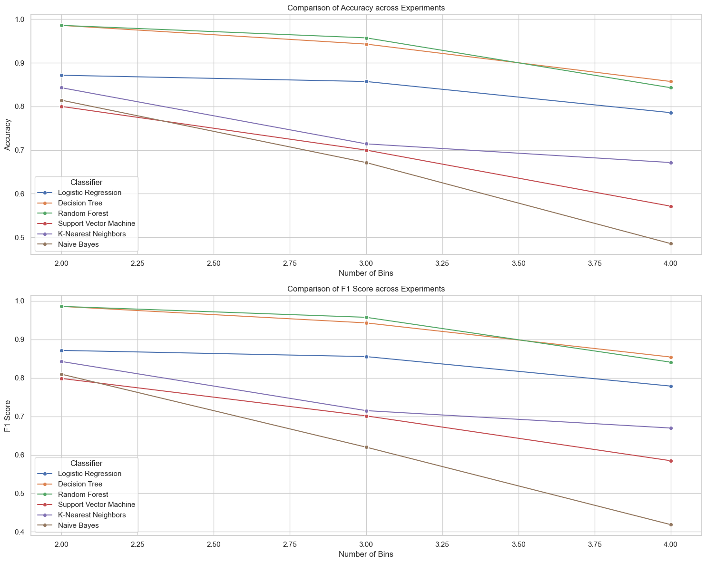

# Colorectal Carcinoma Recurrence Prediction

This repository contains the code, data, and documentation for predicting the recurrence of colorectal carcinoma using machine learning models. The project aims to develop predictive models to foresee cancer recurrence, aiding in personalized treatment plans and improving patient outcomes.

## Project Overview

Colorectal carcinoma is a significant health issue globally, ranking as the third most commonly diagnosed cancer and the second leading cause of cancer-related deaths. Approximately 30-50% of patients experience recurrence, with many cases involving metastasis to other organs such as the lungs. This study focuses on developing predictive models for cancer recurrence, which can aid in personalized treatment plans and improve patient outcomes.

    

## Data Collection and Preprocessing

Our data was collected from the cBioPortal, consisting of 348 records. Initially, we had 50 features by joining the patient, sample, and mutation datasets. However, after preprocessing, we were left with 35 of the most important features that provided the most relevant information for our analysis. Proper preprocessing is crucial to handle the complexities and variabilities in the data.

## Data Overview

Our dataset includes three primary types of data:
- **Clinical patient data**
- **Clinical sample data**
- **Mutation data**

These datasets provide a comprehensive view of the patient's health, the samples collected, and genetic mutations, respectively.

## Target Variable

- **PFS (Progression-Free Survival) Months (y):** This is the target variable we aim to predict. PFS months measure how long a patient lives without their cancer worsening after starting treatment. It is a key metric in cancer treatment effectiveness and patient prognosis.

## Data Splitting

- **Training Data (20%):** Used to train the machine learning model.
- **Test Data (80%):** Used to evaluate the model's performance.

## Model Training and Evaluation

1. **Model Training:** The machine learning algorithm is applied to the training data to build a model.
2. **Model Testing:** The trained model is then tested on the test dataset.
3. **Performance Metrics:** The performance of the model is evaluated using accuracy and F1 score.

## Multiclass Classification Approach

We employed a multiclass classification approach to predict cancer recurrence. Each class or bin contains a roughly equal number of records, although the size of each class can vary. This approach helps in balancing the data and improving the model's performance without being biased.

## Model Performance Comparison

We compared the performance of six classifiers across different numbers of bins:
- **Logistic Regression**
- **Decision Tree**
- **Random Forest**
- **Support Vector Machine**
- **K-Nearest Neighbors**
- **Naive Bayes**

### Key Observations:
1. **Random Forest:** Consistently high accuracy and F1 score across different bin numbers.
2. **Support Vector Machine:** Maintains high performance but slightly less consistent than Random Forest.
3. **Logistic Regression:** High performance initially, declines with more bins.
4. **Decision Tree:** Moderate performance, showing decline as bins increase.
5. **K-Nearest Neighbors:** Slightly lower but stable performance.
6. **Naive Bayes:** Performs the worst, with significant drops as bin numbers increase.

    

Overall, Random Forest and Decision Tree are the best performers, especially when the number of bins increases, while Naive Bayes is the least effective.

## Conclusion

This study demonstrates the potential of machine learning models in predicting cancer recurrence, particularly using Random Forest and Support Vector Machine classifiers. Accurate predictions can significantly aid in personalized treatment plans, improving patient outcomes and advancing cancer treatment strategies.

## References

- Angela E. Schellenberg, "Risk Analysis of Colorectal Cancer Recurrence."
- Paul R. Barber, "Predicting Progression-Free Survival after Systemic Therapy."
- Yifeng Tao, "From genome to phenome: Predicting multiple cancer phenotypes based on somatic genomic alterations via the genomic impact transformer."
- Mingyu Jin1, "Health-LLM: Personalized Retrieval-Augmented Disease Prediction System"

## Repository Contents

- `data/`: Folder containing the dataset used for this study.
- `preprocessing.ipynb/`: Please send an email to sanjuktabaruah5@gmail.com to receive this file.
- `evaluation.ipynb/`: Python scripts for various ML model training, and evaluation code.
- `results/`: Folder containing model performance metrics and visualizations.

## Getting Started

1. Clone this repository: `https://github.com/Sanjukta2212/Colorectal_Carcinoma_Recurrence`
2. Install the required dependencies: `pip install -r 01_requirements.rtf`
3. Run the notebooks or scripts to reproduce the analysis and results.

## License

This project is licensed under the MIT License. See the `LICENSE` file for more details.
